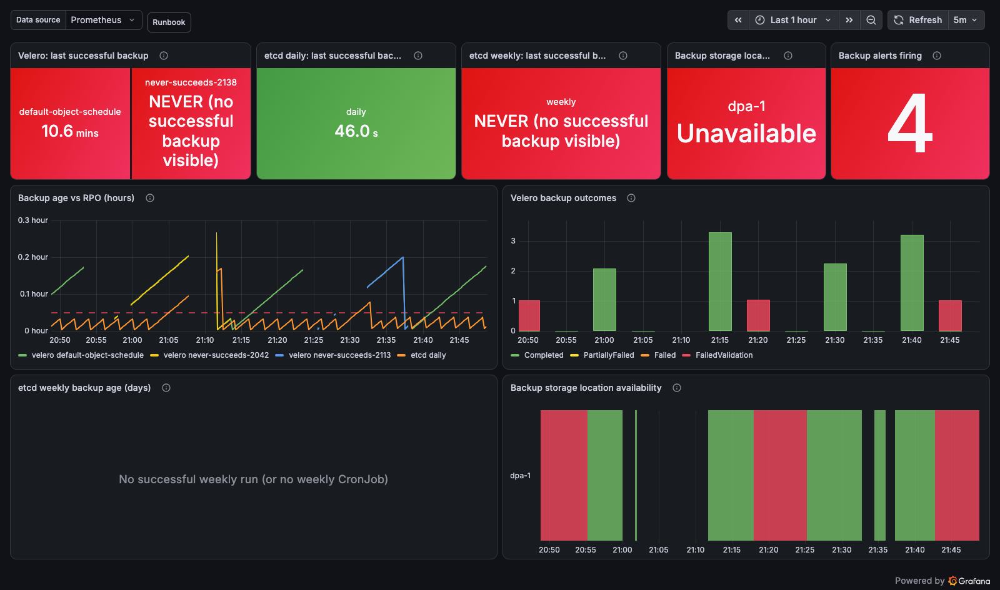
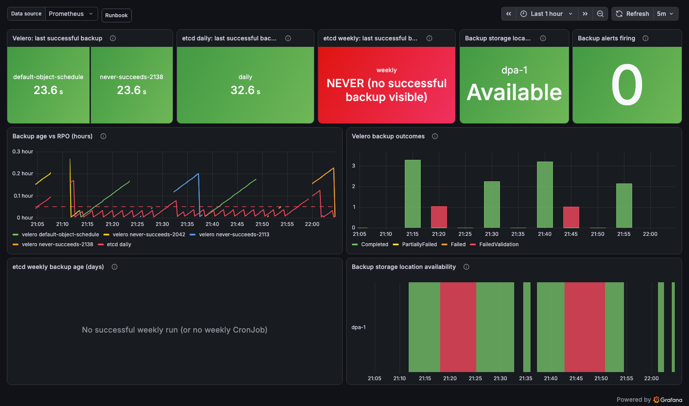

# oadp-observability

Prometheus alerts, a small state exporter, and a Grafana dashboard for **OADP** (OpenShift API
for Data Protection, i.e. Velero on OpenShift), built for OpenShift user-workload monitoring and
the grafana-operator.

For every backup schedule it answers: **is it producing successful backups on time, and if not,
why?** It alerts on the *outcome* per schedule (time since the last **successful** backup, including
"never succeeded"), not on proxies. It names the cause
(an unreachable bucket, failed runs), and warns when the monitoring itself goes blind. Every
alert clears on its own once a backup succeeds again.

Sibling of [`../oadp-operator`](../oadp-operator) and [`../oadp-instance`](../oadp-instance),
which install OADP. This chart only observes it.

> **Status:** built, tested offline and end-to-end on kind, and **validated against a live OADP
> 1.5.8 cluster** (2026-09-30): the real Velero `/metrics` is in `tests/fixtures/velero-metrics.txt`,
> the metrics Service matches the chart's ServiceMonitor, and replaying the live state through
> the rules fires exactly the expected alert (`tests/unit/rules.test.yaml`, L1).

## Alerts

| Alert | Fires when | Severity | Needs |
| --- | --- | --- | --- |
| `OadpBackupStale` | The newest Completed backup of a schedule is older than **that schedule's budget** (see below; default 25h) | critical | Velero scrape |
| `OadpBackupNoSuccessfulBackup` | A Schedule is older than its budget and **no** Completed backup of it is visible (never succeeded, all expired, or Velero isn't scraped) | critical | state exporter |
| `OadpBackupStorageLocationUnavailable` | A BackupStorageLocation isn't `Available` for 15m, so every backup to it will fail | critical | state exporter |
| `OadpBackupFailed` | A backup ended `Failed` / `FailedValidation` / `PartiallyFailed` within `window` (12h). The `phase` label says which. | warning | Velero scrape |
| `OadpRestoreFailed` | A restore ended `Failed` / `FailedValidation` / `PartiallyFailed` within `window` (12h). Includes every restore (most carry no `schedule` label). | warning | Velero scrape |
| `OadpMetricsAbsent` | The series these alerts depend on don't exist (`target`: velero, backupstoragelocations, schedules) | warning | per enabled component |
| `OadpTargetDown` | The Velero or state-exporter scrape target is down | critical | per enabled component |

`Stale` and `NoSuccessfulBackup` are mutually exclusive. Ad-hoc backups (`schedule=""`) are
excluded. Velero's own `velero_backup_last_status` is deliberately **not** used: Velero resets it
to 1 every minute. See [`docs/design.md`](docs/design.md) for why each alert is shaped this way.

## Per-schedule budgets: the RPO travels with the Schedule

Different schedules have different RPOs: a daily platform backup can be 25h late before it
matters, an hourly database backup cannot. So the budget is declared **on the Schedule**, by
whoever owns it, in the same manifest, and no chart values need to change when schedules are
added:

```yaml
apiVersion: velero.io/v1
kind: Schedule
metadata:
  name: db-hourly
  annotations:
    oadp-observability.stakater.com/max-age-hours: "2"   # hours, plain decimal, no unit
spec:
  schedule: "0 * * * *"
```

- The state exporter reads the annotation into `kube_customresource_schedule_max_age_hours`.
- The recording rule `oadp:schedule_budget_seconds` resolves every schedule's budget: the
  annotation if present, else `prometheus.rules.velero.backupStale.maxAgeHours` (25h).
- `OadpBackupStale`, `OadpBackupNoSuccessfulBackup`, and the dashboard's status table all
  compare each schedule against its own budget.
- **Value format:** hours as a plain decimal (`"2"`, `"0.5"`). Not `"30m"` or `"1h"`: the
  exporter parses Kubernetes quantities, so `30m` would mean 0.03 hours and `1h` would be
  ignored. A wrong value shows up as a wrong Budget column and an early or late alert, never
  as silence.
- **Existing schedules need no change.** A schedule without the annotation simply gets the
  default. That includes the platform-wide `default-object-schedule` that [`../oadp-instance`](../oadp-instance)
  ships: it runs daily, and the 25h default fits it. Add the annotation only where a schedule's
  RPO differs from the default.
- Without the state exporter, every schedule uses the default.

## The state exporter

Velero doesn't publish whether its backup bucket is reachable, how long a schedule has existed,
or a schedule's RPO budget. All three are needed: the first names the most common cause, the
second catches a schedule that has *never* succeeded, and the third makes budgets per schedule.
The chart can run a stock **kube-state-metrics** (read-only, one small pod) that turns those
object fields into metrics. It's off by default; see
[`docs/state-exporter.md`](docs/state-exporter.md) for what it is, what it exports, its
permissions, and troubleshooting.

## Dashboard

**OADP / Backup Status** (`grafana.dashboard.enabled`, on by default) shows, per schedule, whether
backups are succeeding on time, without `oc`:
- **Velero status table:** one row per schedule, worst first, with the age of its last
  *successful* backup, the schedule's own budget, and a status of `OK`, `STALE` (age over
  budget, the same test as `OadpBackupStale`) or `NEVER` (the schedule exists but no success is
  visible). It stays readable with many schedules.
- **Tiles:** BSL phase per location, and backup alerts firing.
- **Charts:** backup age as a fraction of each schedule's budget (1 = breach), Velero outcomes
  over time, and BSL availability over time.
### Screenshots

Taken by the end-to-end suite ([`tests/e2e/`](tests/e2e/README.md)) on kind, with real Velero 1.16.2,
the chart installed as-is, and alert timings shortened (minutes instead of 25h).

**During an outage.** The bucket is unreachable (BSL `Unavailable`), one schedule is `STALE`
(its last success is past the budget), and a new schedule has `NEVER` succeeded. The status
table sorts worst first:



**After recovery.** The bucket is fixed and fresh backups exist. Every alert resolved by itself,
and the charts still show the outage window:



## Install

```bash
helm upgrade --install oadp-observability . -n openshift-adp \
  --set prometheus.monitors.veleroServiceMonitor.enabled=true \
  --set stateExporter.enabled=true
```

Both are opt-in, so **installing the chart alone monitors nothing**. The objects must land in the
namespace Velero runs in (`openshift-adp`), so user-workload monitoring scrapes it and evaluates
the rules there. Route alerts with `prometheus.rules.labels`, which is merged into every
PrometheusRule.

## Docs

| Doc | For |
| --- | --- |
| [`docs/runbook.md`](docs/runbook.md) | On-call: what each alert means, the first commands, when it clears |
| [`docs/state-exporter.md`](docs/state-exporter.md) | Operators: the optional exporter, including what, why, permissions, and troubleshooting |
| [`docs/design.md`](docs/design.md) | Maintainers: the Velero source facts behind each alert, trade-offs, limitations |
| [`tests/METRICS-CAPTURE.md`](tests/METRICS-CAPTURE.md) | The release gate: capturing real Velero metrics |

## Testing

- `./tests/validate.sh` runs offline (local `promtool`/`kubeconform` if present, otherwise
  Docker). It checks public-repo hygiene, `helm lint`/`template`, `promtool check` and
  `promtool test` (alert logic and dashboard tile logic), that every metric is captured or
  cited, that runbook anchors resolve, the dashboard (required panels, JSON, PromQL parse), and
  runs strict kubeconform against vendored CRD schemas.
- `./tests/e2e/` stands up the full stack on kind (Prometheus Operator, Alertmanager,
  grafana-operator, real Velero 1.16.2) and drives **every alert to firing, delivered to
  Alertmanager, and back to resolved**, including the never-succeeded and the
  expired-and-restarted cases. See [`tests/e2e/README.md`](tests/e2e/README.md) and the latest
  report in [`tests/reports/`](tests/reports/).
- `./tests/component/state-exporter.sh` runs the exporter on a throwaway kind cluster
  (isolated kubeconfig) against the real Velero 1.16 CRDs and asserts its output.
