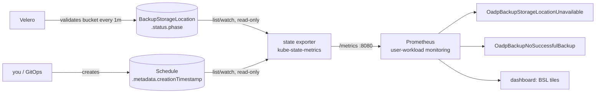

# The OADP state exporter

A small, optional component this chart deploys next to Velero. It turns two facts that live on
Velero's Kubernetes objects into Prometheus metrics, because Velero doesn't publish them itself
and two of this chart's most important alerts depend on them.

- **What it is:** a stock [kube-state-metrics](https://github.com/kubernetes/kube-state-metrics)
  (`v2.20.0`), the same upstream tool OpenShift already runs for Pods and Deployments. It runs
  in its *custom-resource-state* mode and is configured to read **only** Velero's
  `BackupStorageLocation` and `Schedule` objects. It isn't custom code.
- **What it isn't:** it doesn't talk to Velero, the bucket, or any cloud API. It reads no
  Secrets, changes nothing, and stores nothing. It's one read-only pod.

## Why it exists

Prometheus can only alert on numbers it scrapes. Velero's `/metrics` endpoint has two gaps that
matter for "is every schedule producing successful backups on time?":

| Gap | Where the fact lives | Why it matters |
| --- | --- | --- |
| **Is the backup bucket reachable?** | Velero validates each BackupStorageLocation (BSL) every minute and writes `Available` / `Unavailable` to `.status.phase` (`oc get backupstoragelocations`). Velero publishes **no metric** for it. | An Unavailable BSL makes **every** backup end `FailedValidation`. Without this, the only signal is "no successful backup for 25h", which arrives a day late and doesn't say why. |
| **What is each schedule's RPO budget?** | An annotation on the Schedule, set by whoever owns it (`oadp-observability.stakater.com/max-age-hours`). | An hourly database backup and a daily platform backup can't share one 25h budget. Reading it here keeps the budget with the schedule instead of in a values file that drifts. |
| **How long has a schedule existed?** | `Schedule.metadata.creationTimestamp`. It isn't a metric. | Needed to detect a schedule that has **never** succeeded. Velero's "last successful backup" metric only appears *after* a first success, so "older than 25h" can't fire on a series that never existed. Velero's own `velero_backup_last_status` can't stand in either: Velero resets it to 1 ("success") every minute (see `design.md`). |



## What it exports

| Metric | Labels | Value | Source field | Used by |
| --- | --- | --- | --- | --- |
| `kube_customresource_backupstoragelocation_status_phase` | `name`, `phase` (`Available` / `Unavailable`) | `1` for the current phase, `0` for the other | `BackupStorageLocation.status.phase` | `OadpBackupStorageLocationUnavailable`, the dashboard BSL panels, `OadpMetricsAbsent{target="backupstoragelocations"}` |
| `kube_customresource_schedule_created` | `schedule` | Unix seconds | `Schedule.metadata.creationTimestamp` | `OadpBackupNoSuccessfulBackup`, the dashboard "NEVER" tile, `OadpMetricsAbsent{target="schedules"}` |
| `kube_customresource_schedule_max_age_hours` | `schedule` | hours (from the annotation string) | `Schedule.metadata.annotations["oadp-observability.stakater.com/max-age-hours"]`; **no series if unannotated** | the `oadp:schedule_budget_seconds` recording rule, hence `OadpBackupStale`, `OadpBackupNoSuccessfulBackup`, the table's Budget/Status columns |

Every series also carries `customresource_group`, `customresource_kind`, and
`customresource_version`. They deliberately carry **no** `namespace` label: user-workload
monitoring stamps the scrape target's namespace (`openshift-adp`), and a second one would
surface as `exported_namespace` and break the rules' `on (namespace, …)` joins.

Real output, captured by the component test (`tests/fixtures/state-exporter-metrics.txt`):

```text
kube_customresource_backupstoragelocation_status_phase{…,name="dpa-1",phase="Available"} 0
kube_customresource_backupstoragelocation_status_phase{…,name="dpa-1",phase="Unavailable"} 1
kube_customresource_schedule_created{…,schedule="default-object-schedule"} 1.7e+09
```

A BSL whose `.status.phase` isn't set yet produces **no** series (kube-state-metrics behaviour).
The watchdog treats that as "blind", not as healthy. Likewise an unannotated Schedule produces no
budget series, and the recording rule supplies the default. The annotation value is parsed as a
Kubernetes quantity, so write hours as a plain decimal (`"2"`, `"0.5"`), never `"30m"` or `"1h"`.

## Enabling it

It's **off by default**, like the chart's monitors, because it adds a Deployment to
`openshift-adp`:

```bash
helm upgrade --install oadp-observability . -n openshift-adp \
  --set prometheus.monitors.veleroServiceMonitor.enabled=true \
  --set stateExporter.enabled=true
```

| Value | Default | Notes |
| --- | --- | --- |
| `stateExporter.enabled` | `false` | Also gates the two alerts that need it and its watchdog entries. |
| `stateExporter.image.repository` / `.tag` | `registry.k8s.io/kube-state-metrics/kube-state-metrics` / `v2.20.0` | Mirror it if your clusters can't reach `registry.k8s.io`. |
| `stateExporter.interval` | `30s` | Scrape interval. |
| `stateExporter.runAsUser` | unset | **Leave unset on OpenShift**, where `restricted-v2` assigns a UID from the namespace range and rejects a fixed one outside it. **Set it on vanilla Kubernetes** (for example `65534`): the image's user is the non-numeric `nobody`, which `runAsNonRoot` can't verify otherwise. |
| `stateExporter.resources` | 10m CPU / 384Mi request, 768Mi limit | Not sized by the two Velero kinds it watches: its CRD informer loads every CRD in the cluster (~290Mi RSS with 2023 CRDs), so it scales with the CRD count. |

**Objects it creates** (all named `<release>-oadp-observability-state-exporter`): a ConfigMap
(the custom-resource-state config), ServiceAccount, ClusterRole, ClusterRoleBinding,
Deployment (1 replica), Service (`http-metrics` 8080), and ServiceMonitor.

**Permissions (ClusterRole, read-only):**

| API group | Resource | Verbs | Why |
| --- | --- | --- | --- |
| `apiextensions.k8s.io` | `customresourcedefinitions` | list, watch | kube-state-metrics discovers custom resources through their CRDs (upstream requirement). |
| `velero.io` | `backupstoragelocations`, `schedules` | list, watch | The two objects it reports on. |

The role is cluster-scoped so the informer works regardless of how kube-state-metrics scopes
custom resources. The Deployment also passes `--namespaces=<release namespace>`, and both kinds
only exist in the OADP namespace anyway.

**Pod security:** non-root, no privilege escalation, all capabilities dropped, read-only root
filesystem, `RuntimeDefault` seccomp. It fits OpenShift's `restricted-v2` SCC unchanged.

## If you leave it off

| Still works | Doesn't exist |
| --- | --- |
| `OadpBackupStale` (every schedule at the default budget), `OadpBackupFailed` (including `phase="FailedValidation"`), the Velero watchdog, the dashboard's Velero rows | `OadpBackupStorageLocationUnavailable` (the bucket cause, within 15m), `OadpBackupNoSuccessfulBackup` (**never succeeded / all expired**), per-schedule budgets, the dashboard's BSL panels and NEVER rows |

The second column holds exactly the alerts for the failure where nothing ever succeeds. That's
why we recommend enabling it.

## Checking it works

```bash
NS=openshift-adp
oc -n $NS get deploy,svc,servicemonitor -l app.kubernetes.io/component=state-exporter
oc -n $NS port-forward svc/<release>-oadp-observability-state-exporter 8080:8080 &
curl -s localhost:8080/metrics | grep '^kube_customresource_'
```

You should see one `…status_phase` pair per BSL, and one `…schedule_created` per Schedule.

## Troubleshooting

| Symptom | Likely cause | Fix |
| --- | --- | --- |
| Pod `CreateContainerConfigError`: *"image has non-numeric user (nobody), cannot verify user is non-root"* | Vanilla Kubernetes, `runAsUser` unset | Set `stateExporter.runAsUser=65534` |
| Pod rejected by SCC on OpenShift | `runAsUser` set to a UID outside the namespace range | Unset `stateExporter.runAsUser` |
| `OadpMetricsAbsent{target="backupstoragelocations"}` or `{target="schedules"}` | Logs show `forbidden` (RBAC), no BSL/Schedule exists, or a BSL has no `.status.phase` yet | `oc -n $NS logs deploy/<release>-oadp-observability-state-exporter`; check `oc get bsl,schedules -n $NS` |
| `OadpTargetDown{target="state-exporter"}` | The pod isn't running or ready | `oc -n $NS describe pod -l app.kubernetes.io/component=state-exporter` |
| Series present, but alerts show `exported_namespace` | Someone added a `namespace` label to the config | Keep the config as shipped (see "What it exports") |

## How it's tested

`tests/component/state-exporter.sh` creates a throwaway kind cluster with an isolated kubeconfig
and installs the pinned Velero 1.16 CRDs, an `Unavailable` BSL, and a Schedule. It deploys the
chart's own exporter manifests (so RBAC gaps fail the test), scrapes `/metrics`, and asserts:
the StateSet values, the `schedule` label, that the RFC3339 timestamp is parsed to Unix seconds,
and that there's no `namespace` label. Then it rewrites the fixture. The alert logic that
consumes these series is covered by `tests/unit/rules.test.yaml` (promtool).
