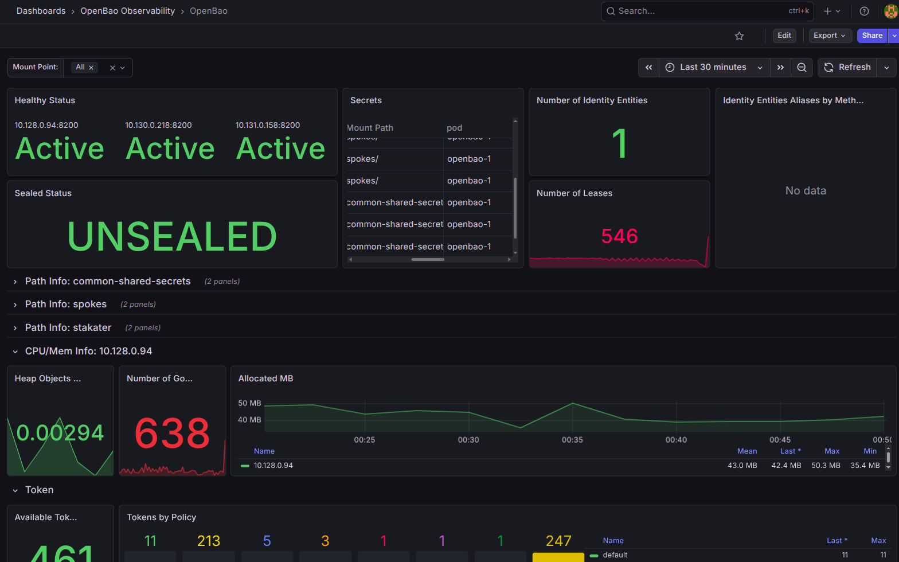

# openbao-observability

A Helm chart for **SAAP OpenBao** observability, integrated with **OpenShift user-workload monitoring (UWM)**. It is the OpenBao counterpart to [`vault-observability`](../vault-observability) (OpenBao keeps Vault's `vault_*` telemetry names).

It ships three kinds of resource into the OpenBao namespace:

| Resource | Purpose |
| --- | --- |
| `ServiceMonitor` | Scrapes `/v1/sys/metrics` on **every** OpenBao server pod via the headless `openbao-internal` service. |
| `PrometheusRule` (×12) | Alerts on availability, seal/leadership, raft/quorum, request latency, and audit-log failures. One rule per file under `templates/prometheus/rules/openbao/`. |
| `GrafanaDashboard` | OpenBao dashboard (reuses the Vault panels), applied via grafana-operator. Gated on `grafana.dashboard.enabled`. |

## Why scrape the headless service

The headless `openbao-internal` service sets `publishNotReadyAddresses: true`, so a **not-ready (e.g. `0/1`) pod stays a scrape target** and `up == 0` fires for it. The default upstream ServiceMonitor targets the `-active` (leader) service only, which would not catch a standby going `0/1` — the failure mode that originally went unalerted.

## Prerequisites

### 1. OpenShift user-workload monitoring enabled

```yaml
# openshift-monitoring/cluster-monitoring-config configmap
data:
  config.yaml: |
    enableUserWorkload: true
```

UWM evaluates these `PrometheusRule`s in `thanos-ruler-user-workload`.

### 2. OpenBao must expose metrics unauthenticated *(server-side change)*

OpenBao's `/v1/sys/metrics` endpoint returns **403** on the active node and **400** on standbys unless the TCP listener allows unauthenticated metrics access. Add this to the listener stanza in the OpenBao server config and roll the StatefulSet:

```hcl
listener "tcp" {
  ...
  telemetry {
    unauthenticated_metrics_access = true
  }
}
```

The top-level `telemetry { prometheus_retention_time, disable_hostname = true }` stanza should also be present.

## Configuration

| Key | Default | Description |
| --- | --- | --- |
| `openbao.name` | `openbao` | Release/fullname of the OpenBao install (drives the ServiceMonitor selector). |
| `openbao.service` | `openbao-internal` | Headless service fronting every server pod. |
| `openbao.replicas` | `3` | Expected HA replica count (drives replica/peer alerts). |
| `prometheus.monitors.serviceMonitor.enabled` | `false` | Create the ServiceMonitor. |
| `prometheus.monitors.serviceMonitor.interval` | `30s` | Scrape interval. |
| `prometheus.monitors.serviceMonitor.tls.*` | `openbao-server-tls` / `ca.crt` / `openbao` | CA secret, key, and serverName for the HTTPS scrape. |
| `prometheus.rules.labels` | `{}` | Extra labels added to every `PrometheusRule`. |
| `prometheus.rules.openbao.<alert>.enabled` | `true` | Toggle an individual alert. |

### Alerts

| Alert | Condition |
| --- | --- |
| `OpenBaoPodDown` | `up == 0` for a server pod |
| `OpenBaoMissingReplicas` | `count(up == 1) < replicas` |
| `OpenBaoAllDown` | no pod reporting `up == 1` |
| `OpenBaoSealed` | `vault_core_unsealed == 0` |
| `OpenBaoNoActiveNode` | no node with `vault_core_active == 1` |
| `OpenBaoLeadershipChurn` | repeated `vault_core_leadership_lost_count` increase |
| `OpenBaoAutopilotUnhealthy` | `vault_autopilot_healthy == 0` |
| `OpenBaoRaftQuorumRisk` | `vault_autopilot_failure_tolerance == 0` |
| `OpenBaoRaftPeersLow` | `vault_raft_peers < replicas` |
| `OpenBaoStandbyLagging` | p99 `vault_raft_leader_lastContact` over threshold |
| `OpenBaoHighRequestLatency` | p99 `vault_core_handle_request` over threshold |
| `OpenBaoAuditLogFailure` | `vault_audit_log_{request,response}_failure` increasing |

## Dashboard

Enabled with `grafana.dashboard.enabled=true`. The dashboard reuses the [`vault-observability`](../vault-observability) panels (OpenBao keeps Vault's `vault_*` metric names).



Panel-by-panel value & purpose:

### Overview

| Panel | Query | Value / purpose |
| --- | --- | --- |
| **Healthy Status** | `up{job="openbao-internal"}` | Per-pod scrape health — one tile per server pod. Visual proof every pod (incl. a `0/1` standby) is being scraped — the gap that caused the original incident. |
| **Sealed Status** | `max(1 + vault_core_unsealed)` | Cluster seal state (UNSEALED / SEALED) — the single most important security + availability indicator. |
| **Secrets** | `vault_secret_kv_count` | KV secret count per mount path — inventory & growth. |
| **Number of Identity Entities** | `vault_identity_num_entities` | Count of identity entities (unique clients) — client-count signal. |
| **Identity Entity Aliases by Method** | `vault_identity_entity_alias_count` | Breakdown of entity aliases per auth method. |
| **Number of Leases** | `vault_expire_num_leases` | Active lease count — lease-explosion / expiration-load early warning. |

### Path Info (templated per `$mountpoint`)

| Panel | Query | Value / purpose |
| --- | --- | --- |
| **Number of Operations** | `increase(vault_route_{create,delete,read}_…__count[5m])` | Request volume per secret mount. |
| **Time of Operations** | `rate(…_sum)/rate(…_count)*1000` | Per-mount operation latency (ms); pairs with the `OpenBaoHighRequestLatency` alert. |

### CPU / Mem Info (templated per `$node`)

| Panel | Query | Value / purpose |
| --- | --- | --- |
| **Heap Objects Used** | `vault_runtime_heap_objects / vault_runtime_malloc_count` | Heap-object ratio — memory pressure / GC behaviour. |
| **Number of Goroutines** | `vault_runtime_num_goroutines` | Concurrency / goroutine-leak indicator. |
| **Allocated MB** | `vault_runtime_alloc_bytes` | Allocated heap over time. |

### Token

| Panel | Query | Value / purpose |
| --- | --- | --- |
| **Available Tokens** | `vault_token_count` | Total tokens in the cluster. |
| **Pending Tokens** | `vault_token_create_count - vault_token_store_count` | Tokens created but not yet persisted. |
| **Tokens by Policy / TTL / Auth Method** | `vault_token_count_by_{policy,ttl,auth}` | How the token population breaks down — spot a policy/method creating tokens unexpectedly. |
| **Tokens Creation by Method & TTL** | `vault_token_creation` | Token creation rate split by auth method + creation TTL. |
| **Token Creation/Storage** | `vault_token_{create,store}_count` | Creation vs storage throughput. |
| **Token Lookups** | `irate(vault_token_lookup_count[1m])` | Token lookup rate — auth load indicator. |

### Audit

| Panel | Query | Value / purpose |
| --- | --- | --- |
| **Log Request Failures** | `idelta(vault_audit_log_request_failure[1m])` | **Critical**: when the audit device fails, OpenBao *blocks* requests. Maps to the `OpenBaoAuditLogFailure` alert. |
| **Log Response Failures** | `idelta(vault_audit_log_response_failure[1m])` | Same, for the response side of audit logging. |
| **Log Requests** | `irate(vault_audit_log_{request,response}_count[1m])`, `irate(vault_core_handle_request_count[1m])` | Audit + request throughput. |

### Policy

| Panel | Query | Value / purpose |
| --- | --- | --- |
| **Policy Set** | `irate(vault_policy_set_policy_count[1m])` | Policy write rate. |
| **Policy Get** | `irate(vault_policy_get_policy_count[1m])` | Policy read rate. |

> **Note:** the source Vault dashboard's **Consul Requests** panel (`vault_consul_*`) was removed — this OpenBao deployment uses **raft** storage, so that panel was permanently empty.
